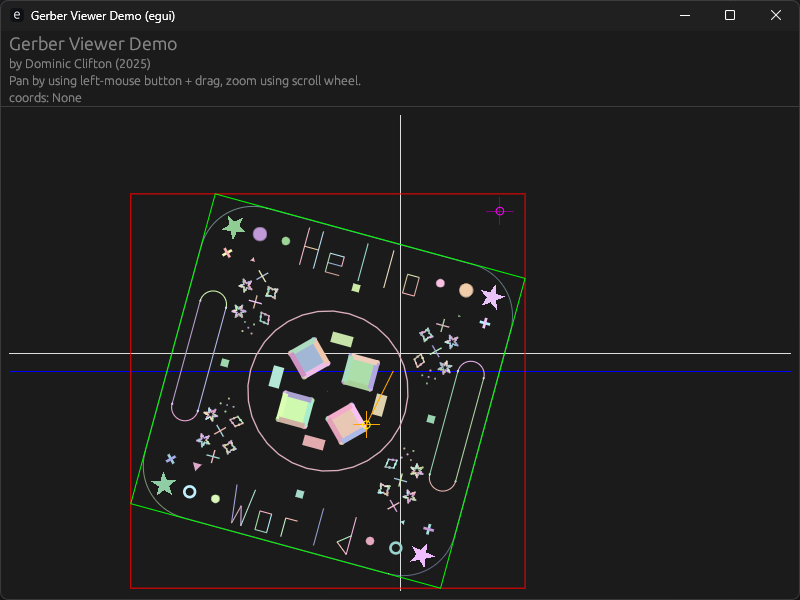

# Gerber viewer

[![Build status][build-status-badge]][build-status]
[![Crates.io][crates-io-badge]][crates-io]
[![MakerPnP Discord][discord-badge]][discord]

- [Docs (released)](https://docs.rs/gerber-viewer/)

A cargo crate for rendering Gerber files.

Uses `gerber-types` for specification of the gerber commands.

Gerber types can be programatically defined, or gerber files can be imported with the `gerber-parser`

This crate is used as core component of the [MakerPnP](https://github.com/MakerPnP/makerpnp) project, here's a screenshot from the MakerPnP gerber viewer:

[](assets/makerpnp_gerber_viewer/screenshots/gerber_viewer_2025-05-01_221636.png)


## Cargo Features

* `egui` Adds rendering support using egui.
* `parser` Adds the gerber parser as a re-export. This is helpful so you can depend just on this crate and ensures there
  are no version mismatches between the gerber types, gerber parser and gerber rendering.
* `types` Adds the gerber types as a re-export.  See above.

For the default features, see the [`Cargo.toml`](Cargo.toml)

## Demo

There is a minimal stand-alone demo app which renders the `demo/assets/demo.gbr` file.

Run it:
```
cd demo
cargo run --release
```

See `demo/src/main.rs` and `demo/Cargo.toml` for details.

Screenshot:



Red box = Axis aligned bounding box.
Green box = layer bounding box.
Blue cross-hair = Gerber 0,0 origin.
White cross-hair = Viewport center.
Orange line and point = Design offset.
Purple point = Design origin.
Single gerber layer rendered with individual shape coloring debug mode enabled.

Video (from a slightly older version):


## Rendering

Currently only egui is supported, but the code could be adapted for other rendering methods, PR's welcome.

## Status

Renders many gerbers files, but not all gerber commands and features are supported yet, see below.  The MakerPnP project
is currently the driving force for upcoming changes.

Current features are likely sufficient for viewing most modern PCB gerber files, the macro support is a key feature.

The list of supported features will be improved as developer time permits, if you'd like to contribute, please see the
 section below.

### Supported gerber features

| Supported | Feature                              | Notes                               |
|-----------|--------------------------------------|-------------------------------------|
| ✅         | Plot/Move/Flash (D01/D02/D03)        |                                     |
| ✅         | Regions                              |                                     |
| ✅         | Aperture macros (AM)                 |                                     |
| ✅         | Macro variables                      |                                     |
| ✅         | Macro expressions                    |                                     |
| ✅         | Vector Line primitive                |                                     |
| ✅         | Center Line primitive                |                                     |
| ✅         | Obround primitive                    |                                     |
| ✅         | Rectangle primitive                  |                                     |
| ✅         | Circle primitive                     |                                     |
| ✅         | Concave and convex polygon primitive |                                     |
| ✅         | Outline primitive                    |                                     |
| ✅         | Linear plotting (G01)                |                                     |
| ✅         | Circle apertures with holes          |                                     |
| ✅         | Circular plotting (G02/G03)          | Currently only with circle aperture |
| ✅         | Step-repeat blocks (SR)              |                                     |
| ✅         | Block aperture (AB)                  | Including nesting                   |

### Other UI/Rendering features

| Supported | Feature                                    |
|-----------|--------------------------------------------|
| ✅         | Rotation of layer with user-defined origin |
| ✅         | Mirroring of layer                         |
| ✅         | X/Y Offset of layer                        |
| ✅         | Debug modes                                |

### Currently unupported gerber features

| Supported | Feature                              | Notes                                   |
|-----------|--------------------------------------|-----------------------------------------|
| ❌         | Thermal primitive                    |                                         |
| ❌         | Exposure                             | Currently only additive in the renderer |

### Unsupported deprecated features

| Supported | Feature                        | Notes                 |
|-----------|--------------------------------|-----------------------|
| ❌         | Single quadrant arc mode (G74) | Deprecated since 2021 |
| ❌         | Image polarity (IP)            | Deprecated since 2013 |
| ❌         | Image rotation (IR)            | Deprecated since 2012 |
| ❌         | Load name (LN)                 | Deprecated since 2013 |
| ❌         | Mirror image (MI)              | Deprecated since 2012 |
| ❌         | Offset (OF)                    | Deprecated since 2012 |
| ❌         | Scale factor (SF)              | Deprecated since 2012 |

### Other rendering limitations

* All arcs are limited to 32 points for now.  This is fine for small arcs, but noticable on larger ones.

## Feedback

If you have gerber files and have rendering issues, please create an issue with screenshots and a gerber file.  If
you're able to create a gerber file with just the elements that have issues that would be preferred.

## Contributing

Use the github issue tracker and pull-requests.  If you're embarking on a large change it's usually a good idea to
open an issue first to state your intention, for bug fixes and small changes just open a PR.

## Related crates

### Gerber Types

A rust crate for definition of gerber types in test.

Crates.io: https://crates.io/crates/gerber-types
Github: https://github.com/MakerPnP/gerber-types

### Gerber Parser

A rust crate for parsing gerber files that uses this crate as a dependency:

Crates.io: https://crates.io/crates/gerber-parser
Github: https://github.com/MakerPnP/gerber-parser

## Related projects

For a list of other projects that use this crate you can check the github 'dependents' page.

https://github.com/MakerPnP/gerber-types/network/dependents

## Authors

* Dominic Clifton - Original author and maintainer. (https://ko-fi.com/dominicclifton)

## Contact / Community

See the github issue tracker or join the [MakerPnP discord server](https://discord.gg/ffwj5rKZuf).

<!-- Badges -->

[build-status]: https://github.com/makerpnp/gerber-viewer/actions/workflows/ci.yml
[build-status-badge]: https://github.com/makerpnp/gerber-viewer/workflows/CI/badge.svg
[crates-io]: https://crates.io/crates/gerber-viewer
[crates-io-badge]: https://img.shields.io/crates/v/gerber-viewer.svg
[discord]: https://discord.gg/ffwj5rKZuf
[discord-badge]: https://img.shields.io/discord/1255867192503832688?label=MakerPnP%20discord&color=%2332c955 
